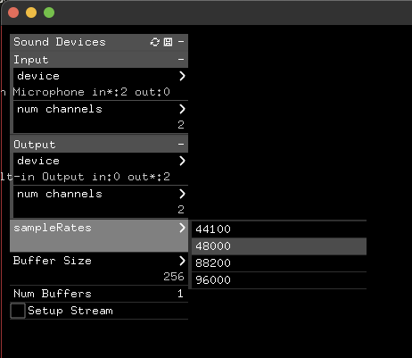

# ofxSoundDeviceManager

Addon for openFrameworks that provides an easy to use GUI for managing audio devices.

This addon provides a GUI within openFramworks that allows to do the following, without needing to restart the app:

* Uses openFrameworks native gui, ofxGui, but can be easily adapted to any other.
* Easily switch from one device to another 
* Change the device's parameters like sample rate, buffer size, etc
* Use prerecorded audio instead of an audio device, but it behaves in the same way. Very useful for testing.
* Save and load settings.
* Intended to be used with [ofxSoundObjects](https://github.com/roymacdonald/ofxSoundObjects)

## Requirements

* [ofxDropdown](https://github.com/roymacdonald/ofxDropdown/)
* [ofxSoundObjects](https://github.com/roymacdonald/ofxSoundObjects) (and its dependencies)

